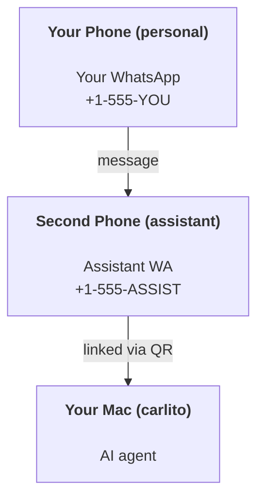

# Building a personal assistant with Carlito

Carlito is a self-hosted gateway that connects Discord, Google Chat, iMessage, Matrix, Microsoft Teams, Signal, Slack, Telegram, WhatsApp, Zalo, and more to AI agents. This guide covers the "personal assistant" setup: a dedicated WhatsApp number that behaves like your always-on AI assistant.

## ⚠️ Safety first

You’re putting an agent in a position to:

- run commands on your machine (depending on your tool policy)
- read/write files in your workspace
- send messages back out via WhatsApp/Telegram/Discord/Mattermost and other bundled channels

Start conservative:

- Always set `channels.whatsapp.allowFrom` (never run open-to-the-world on your personal Mac).
- Use a dedicated WhatsApp number for the assistant.
- Pulsechecks now default to every 30 minutes. Disable until you trust the setup by setting `agents.defaults.pulsecheck.every: "0m"`.

## Prerequisites

- Carlito installed and onboarded — see [Getting Started](/start/getting-started) if you haven't done this yet
- A second phone number (SIM/eSIM/prepaid) for the assistant

## The two-phone setup (recommended)

You want this:



If you link your personal WhatsApp to Carlito, every message to you becomes “agent input”. That’s rarely what you want.

## 5-minute quick start

1. Pair WhatsApp Web (shows QR; scan with the assistant phone):

```bash
carlito channels login
```

2. Start the Gateway (leave it running):

```bash
carlito gateway --port 18789
```

3. Put a minimal config in `~/.carlito/carlito.json`:

```json5
{
  gateway: { mode: "local" },
  channels: { whatsapp: { allowFrom: ["+15555550123"] } },
}
```

Now message the assistant number from your allowlisted phone.

When onboarding finishes, Carlito auto-opens the dashboard and prints a clean (non-tokenized) link. If the dashboard prompts for auth, paste the configured shared secret into Control UI settings. Onboarding uses a token by default (`gateway.auth.token`), but password auth works too if you switched `gateway.auth.mode` to `password`. To reopen later: `carlito dashboard`.

## Give the agent a workspace (AGENTS)

Carlito reads operating instructions and “memory” from its workspace directory.

By default, Carlito uses `~/.carlito/workspace` as the agent workspace, and will create it (plus starter `AGENTS.md`, `SOUL.md`, `TOOLS.md`, `IDENTITY.md`, `USER.md`, `PULSECHECK.md`) automatically on setup/first agent run. `BOOTSTRAP.md` is only created when the workspace is brand new (it should not come back after you delete it). `MEMORY.md` is optional (not auto-created); when present, it is loaded for normal sessions. Subagent sessions only inject `AGENTS.md` and `TOOLS.md`.

Tip: treat this folder like Carlito’s “memory” and make it a git repo (ideally private) so your `AGENTS.md` + memory files are backed up. If git is installed, brand-new workspaces are auto-initialized.

```bash
carlito setup
```

Full workspace layout + backup guide: [Agent workspace](/concepts/agent-workspace)
Memory workflow: [Memory](/concepts/memory)

Optional: choose a different workspace with `agents.defaults.workspace` (supports `~`).

```json5
{
  agent: {
    workspace: "~/.carlito/workspace",
  },
}
```

If you already ship your own workspace files from a repo, you can disable bootstrap file creation entirely:

```json5
{
  agent: {
    skipBootstrap: true,
  },
}
```

## The config that turns it into "an assistant"

Carlito defaults to a good assistant setup, but you’ll usually want to tune:

- persona/instructions in [`SOUL.md`](/concepts/soul)
- thinking defaults (if desired)
- pulsechecks (once you trust it)

Example:

```json5
{
  logging: { level: "info" },
  agent: {
    model: "anthropic/claude-opus-4-6",
    workspace: "~/.carlito/workspace",
    thinkingDefault: "high",
    timeoutSeconds: 1800,
    // Start with 0; enable later.
    pulsecheck: { every: "0m" },
  },
  channels: {
    whatsapp: {
      allowFrom: ["+15555550123"],
      groups: {
        "*": { requireMention: true },
      },
    },
  },
  routing: {
    groupChat: {
      mentionPatterns: ["@carlito", "carlito"],
    },
  },
  session: {
    scope: "per-sender",
    resetTriggers: ["/new", "/reset"],
    reset: {
      mode: "daily",
      atHour: 4,
      idleMinutes: 10080,
    },
  },
}
```

## Sessions and memory

- Session files: `~/.carlito/agents/<agentId>/sessions/{{SessionId}}.jsonl`
- Session metadata (token usage, last route, etc): `~/.carlito/agents/<agentId>/sessions/sessions.json` (legacy: `~/.carlito/sessions/sessions.json`)
- `/new` or `/reset` starts a fresh session for that chat (configurable via `resetTriggers`). If sent alone, the agent replies with a short hello to confirm the reset.
- `/compact [instructions]` compacts the session context and reports the remaining context budget.

## Pulsechecks (proactive mode)

By default, Carlito runs a pulsecheck every 30 minutes with the prompt:
`Read PULSECHECK.md if it exists (workspace context). Follow it strictly. Do not infer or repeat old tasks from prior chats. If nothing needs attention, reply PULSECHECK_OK.`
Set `agents.defaults.pulsecheck.every: "0m"` to disable.

- If `PULSECHECK.md` exists but is effectively empty (only blank lines and markdown headers like `# Heading`), Carlito skips the pulsecheck run to save API calls.
- If the file is missing, the pulsecheck still runs and the model decides what to do.
- If the agent replies with `PULSECHECK_OK` (optionally with short padding; see `agents.defaults.pulsecheck.ackMaxChars`), Carlito suppresses outbound delivery for that pulsecheck.
- By default, pulsecheck delivery to DM-style `user:<id>` targets is allowed. Set `agents.defaults.pulsecheck.directPolicy: "block"` to suppress direct-target delivery while keeping pulsecheck runs active.
- Pulsechecks run full agent turns — shorter intervals burn more tokens.

```json5
{
  agent: {
    pulsecheck: { every: "30m" },
  },
}
```

## Media in and out

Inbound attachments (images/audio/docs) can be surfaced to your command via templates:

- `{{MediaPath}}` (local temp file path)
- `{{MediaUrl}}` (pseudo-URL)
- `{{Transcript}}` (if audio transcription is enabled)

Outbound attachments from the agent: include `MEDIA:<path-or-url>` on its own line (no spaces). Example:

```
Here’s the screenshot.
MEDIA:https://example.com/screenshot.png
```

Carlito extracts these and sends them as media alongside the text.

Local-path behavior follows the same file-read trust model as the agent:

- If `tools.fs.workspaceOnly` is `true`, outbound `MEDIA:` local paths stay restricted to the Carlito temp root, the media cache, agent workspace paths, and sandbox-generated files.
- If `tools.fs.workspaceOnly` is `false`, outbound `MEDIA:` can use host-local files the agent is already allowed to read.
- Host-local sends still only allow media and safe document types (images, audio, video, PDF, and Office documents). Plain text and secret-like files are not treated as sendable media.

That means generated images/files outside the workspace can now send when your fs policy already allows those reads, without reopening arbitrary host-text attachment exfiltration.

## Operations checklist

```bash
carlito status          # local status (creds, sessions, queued events)
carlito status --all    # full diagnosis (read-only, pasteable)
carlito status --deep   # asks the gateway for a live health probe with channel probes when supported
carlito health --json   # gateway health snapshot (WS; default can return a fresh cached snapshot)
```

Logs live under `/tmp/carlito/` (default: `carlito-YYYY-MM-DD.log`).

## Next steps

- WebChat: [WebChat](/web/webchat)
- Gateway ops: [Gateway runbook](/gateway)
- Cron + wakeups: [Cron jobs](/automation/cron-jobs)
- macOS menu bar companion: [Carlito macOS app](/platforms/macos)
- iOS node app: [iOS app](/platforms/ios)
- Android node app: [Android app](/platforms/android)
- Windows status: [Windows (WSL2)](/platforms/windows)
- Linux status: [Linux app](/platforms/linux)
- Security: [Security](/gateway/security)
